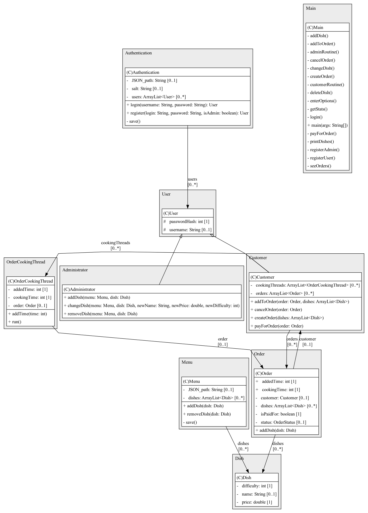

# Симуляция ресторана
###### Домашнее задание по КПО №2, Белов Владислав БПИ225
## Описание
приложение симулирует работу ресторана, в котором есть администарторы и посетители. При входе в приложение пользователю поедлогается зарегисрироваться как новый пользователь (посетитель или админстратор). Все данные пользователей сохраняются в локальном хранилице, пароль напрямую не сохраняется, исполльзуется его хэш с солью.

## Интерфейс администратора
При входе за администратора пользователю предлагается выбрать одно из следующих действий:

1. Посмотреть весь список блюд в меню
2. Добавить новое блюдо в меню
3. Удалить блюдо из меню
4. Изменить блюдо в меню
5. Посмотреть нынешнюю статистику - прибыль
6. Выйти из аккаунта

## Интерфейс посетителя
При входе за посетителя пользователю предлагается выбрать одно из следующих действий:

1. Посмотреть весь список блюд в меню
2. Посмотреть свой заказ
3. Посмотреть все свои заказы
4. Добавить блюдо в заказ
5. Отменить заказ
6. Оплатить заказ
7. Выйти из аккаунта

## UML диаграмма
